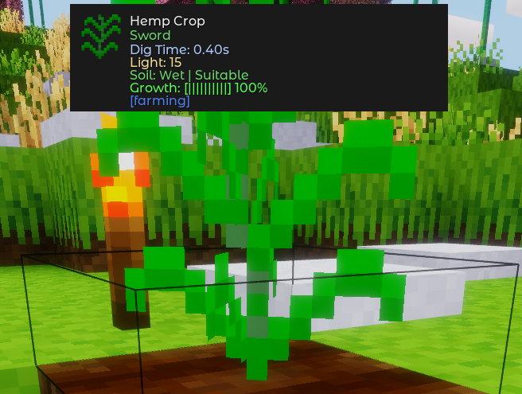
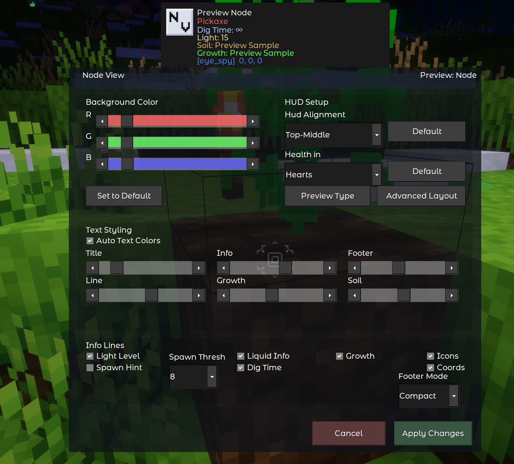
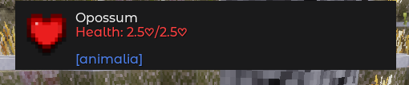
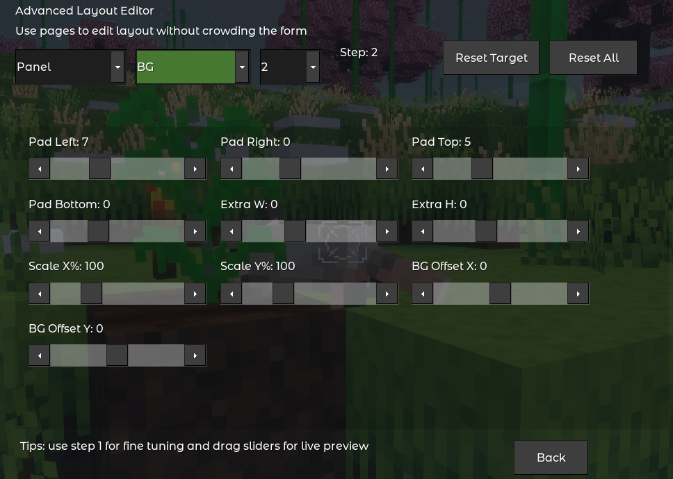

# Eye Spy

**Real-time node, entity, and item inspection — right on your HUD.**

---

Eye Spy adds a live HUD that shows you everything about whatever you are looking at — the node name, which tool breaks it fastest, how long digging takes, the current light level, crop growth and soil status, entity health, and more. Every detail is configurable through an in-game editor with live preview, and the HUD updates continuously as you look around.

## Contents

- [Screenshots](#screenshots)
- [Features](#features)
- [Getting Started](#getting-started)
- [Commands](#commands)
- [Configuration](#configuration)
- [Advanced Layout Editor](#advanced-layout-editor)
- [Localization](#localization)
- [Compatibility](#compatibility)
- [Troubleshooting](#troubleshooting)
- [Contributing](#contributing)
- [License](#license)

## Screenshots

<table>
  <tr>
    <td></td>
    <td></td>
  </tr>
  <tr>
    <td align="center">Crop growth and soil info</td>
    <td align="center">In-game settings editor with live preview</td>
  </tr>
  <tr>
    <td></td>
    <td></td>
  </tr>
  <tr>
    <td align="center">Entity health display</td>
    <td align="center">Advanced Layout Editor</td>
  </tr>
</table>

## Features

### HUD Information

- **Node name and icon** — description and texture of the node you are pointing at
- **Tool requirement** — which tool type breaks the node (Pickaxe, Shovel, Axe, Sword, Hand, Shears), color-coded: green for indicating harvestability with your current tool, orange for correct tool but unharvestable, red for wrong tool and unharvestable.
- **Dig time** — how many seconds it takes to break the node with your current tool; ∞ for unbreakable blocks
- **Light level** — current ambient light at the target position (0–14)
- **Spawn hint** — estimates whether the spot is dark enough for hostile mob spawning, based on a configurable light threshold (off by default)
- **Crop growth** — visual progress bar and percentage for farming crops, with stall detection when soil or light conditions are wrong
- **Soil status** — wet/dry state and fertility suitability for crop soil; also shows directly when you look at a soil block (part of the growth toggle)
- **Liquid info** — liquid type (Water/Lava, etc.), whether it is a source or flowing, and the level value; when enabled, Eye Spy can scan through liquid and still show the target behind it
- **Entity health** — current and maximum HP as numeric points or ❤ hearts
- **Dropped items** — resolves item entities to their actual name, icon, stack count, durability, and metadata
- **Mod origin** — footer shows which mod provides the node or entity. with optional advanced mode which gives it as "modname:technicalname" instead.
- **Coordinates** — optional footer display of the target's world position

### Customization

- **HUD background color** — full RGB slider control with live preview
- **Auto-contrast text** — title text automatically switches between light and dark based on your chosen background color; semantic colors for info, footer, and soil lines are contrast-adjusted automatically
- **Manual color spectrum** — 6 independent hue sliders for Title, Info, Footer, Line, Growth, and Soil colors when auto-contrast is off
- **7 screen positions** — Top-Middle (default), Top-Left, Top-Right, Middle-Left, Middle-Right, Bottom-Left, Bottom-Right
- **Health display format** — numeric Points or ❤ Hearts
- **Per-feature toggles** — enable or disable Light Level, Spawn Hint, Liquid Info, Dig Time, Growth, Icons, and Coordinates independently; Liquid Info is a single toggle that controls both liquid line visibility and scan-through targeting
- **Footer modes** — Compact (mod name only) or Advanced (mod name + full item identifier)
- **Advanced Layout Editor** — 35+ fine-grained sliders for pixel-level positioning of every HUD element

### Performance

- **Adjustable refresh rate** — 100 ms default in singleplayer, 150 ms in multiplayer, configurable from 50–5000 ms
- **Per-player rate overrides** — server admins can set a different refresh interval for specific players without affecting others
- **Multi-layer caching** — target position, render signature, layout geometry, light samples, tool type results, and line colors are all cached to minimize unnecessary work each tick
- **HUD auto-recovery** — if HUD elements go blank after a long session, Eye Spy detects and restores them automatically
- **Optional performance metrics** — per-stage microsecond timing with avg/p95/max reporting via `/eye_spy_perf`

## Getting Started

### Installation

1. Place the `eye_spy` folder inside your world's `mods/` directory.
2. Enable the mod in the mod selection screen before creating or loading a world, **or** add `load_mod_eye_spy = true` to your `world.mt` file.
3. Launch the game — the HUD appears automatically when you join.

### Quick Start

1. Look at any node, entity, or dropped item to see the HUD.
2. Run `/eye_spy_settings` to open the in-game editor.
3. Use the **RGB sliders** to set your preferred background color.
4. Use the **HUD Alignment** dropdown to move the HUD to a comfortable position.
5. Toggle individual info lines under **Info Lines** to show only what you need.
6. Click **Apply Changes** to save.

## Commands

| Command | Description | Privilege |
|---|---|---|
| `/eye_spy_settings` | Opens the settings and live-preview editor | — |
| `/eye_spy_rate show` | Shows your effective refresh rate and the server default | — |
| `/eye_spy_rate default <ms>` | Sets the server-wide HUD refresh rate (50–5000 ms) | `eye_spy_rate` |
| `/eye_spy_rate player <name> <ms\|default>` | Sets or clears a per-player refresh rate override | `eye_spy_rate` |
| `/eye_spy_perf show` | Prints timing stats (avg / p95 / max) for all internal stages | `eye_spy_rate` |
| `/eye_spy_perf reset` | Clears all collected performance samples | `eye_spy_rate` |
| `/eye_spy_perf on` | Enables runtime performance metrics collection | `eye_spy_rate` |
| `/eye_spy_perf off` | Disables runtime performance metrics collection | `eye_spy_rate` |
| `/eye_spy_toggle` | Toggles your Eye Spy HUD on or off | — |
| `/eye_spy_status` | Shows your current HUD status and active refresh rate | — |
| `/eye_spy_admin disable <name>` | Suppresses the HUD for a player server-side | `eye_spy_admin` |
| `/eye_spy_admin enable <name>` | Lifts a server-side HUD suppression for a player | `eye_spy_admin` |
| `/eye_spy_admin show [name]` | Shows HUD status for one or all online players | `eye_spy_admin` |

> The `eye_spy_rate` and `eye_spy_admin` privileges are granted automatically in singleplayer.

## Configuration

These settings can be placed in `minetest.conf` or configured in the server's settings UI. They apply server-wide and take effect on the next server start.

| Setting | Default | Description |
|---|---|---|
| `eye_spy.show_entities` | `true` | Show entity information in the HUD |
| `eye_spy.show_liquids` | `false` | Enable liquid-aware targeting. When Liquid Info is on, Eye Spy scans through liquid, shows a liquid line, and can still display the target behind it |
| `eye_spy.always_show_hand_in_creative` | `true` | Always display "Hand" as the tool type in creative mode |
| `eye_spy.texture_pack_size` | `None` | Force all HUD icons to a fixed resolution. Use this when textures appear at the wrong size with a custom texture pack. Options: `None`, `16x16px`, `32x32px`, `64x64px`, `128x128px`, `256x256px`, and higher |
| `eye_spy.update_interval` | `0.25` | Base update interval in seconds (used as a fallback; the rate system normally controls timing) |
| `eye_spy.enable_perf_metrics` | `false` | Enable performance metrics collection at startup |
| `eye_spy.show_growth` | `true` | Show crop growth and soil status lines |
| `eye_spy.show_icons` | `true` | Show the target icon in the HUD |
| `eye_spy.default_show_coords` | `false` | Default coordinates visibility for new players |
| `eye_spy.default_show_light_level` | `true` | Default light level visibility for new players |
| `eye_spy.default_show_spawn_hint` | `false` | Default spawn hint visibility for new players |
| `eye_spy.default_show_liquid_info` | `true` | Default liquid info visibility for new players |
| `eye_spy.default_show_dig_time` | `true` | Default dig time visibility for new players |

Per-player settings (colors, position, toggles, layout) are stored in player metadata and are managed entirely through the in-game `/eye_spy_settings` editor.

## Advanced Layout Editor

The Advanced Layout Editor gives you fine-grained control over the exact position and scale of every HUD element. Open it from `/eye_spy_settings` → **Advanced Layout**.

The editor is split into three pages:

| Page | What you can adjust |
|---|---|
| **Position** | Global X/Y offset, per-element X/Y offsets, margins, icon and text base positions |
| **Panel** | Background padding (left/right/top/bottom), extra width/height, background scale % |
| **Text** | Scale percentage for Title, Info, Lines, and Footer text independently |

Use the **Target** dropdown to select which element to adjust (Global, BG, Icon, Title, Subtitle, Lines, or Footer). The **Step** control sets the slider increment — use 1 for precise tweaking and 8 for quick coarse movement. All changes preview live on your HUD as you drag. Use **Reset Target** to restore one element or **Reset All** to return everything to defaults.

## Localization

Eye Spy is translated into 8 languages:

| Language | File |
|---|---|
| Czech | `locale/eye_spy.cs.tr` |
| German | `locale/eye_spy.de.tr` |
| Spanish | `locale/eye_spy.es.tr` |
| French | `locale/eye_spy.fr.tr` |
| Italian | `locale/eye_spy.it.tr` |
| Dutch | `locale/eye_spy.nl.tr` |
| Polish | `locale/eye_spy.pl.tr` |
| Russian | `locale/eye_spy.ru.tr` |

To contribute a new translation or improve an existing one, copy `locale/eye_spy.template.tr`, rename it to `eye_spy.<lang_code>.tr`, and fill in the translations on the right side of each `=` line.

## Compatibility

| Game | Status | Notes |
|---|---|---|
| Minetest Game | ✅ Full | Pickaxe, Shovel, Axe, Sword, Hand tool detection |
| MineClone2 | ✅ Full | Pickaxey, Shovely, Axey, Swordy, Shearsy, Handy detection |
| Mineclonia | ✅ Full | Same as MineClone2 |
| VoxeLibre | ✅ Full | Same as MineClone2 |

### Optional dependencies

| Mod | Purpose |
|---|---|
| `default` | Standard node and tool definitions (Minetest Game) |
| `mcl_core`, `mcl_tools` | Node and tool definitions for MineClone-family games |
| `mcl_doc` | Additional MineClone documentation integration |

Eye Spy has **no required dependencies** and works in any game that follows standard Luanti node conventions.

## Troubleshooting

**HUD not appearing**
Run `/eye_spy_settings` and click Apply Changes to force the HUD to reinitialize. Confirm the mod is listed as enabled for your world in `world.mt`.

**Soil shows as Dry even though water is present**
Eye Spy scans for water within 3 blocks of the soil position. If the water source is further away, the farming mod's hydration ABM may not have updated the soil block yet — the HUD will reflect the correct state once it does. Moving the water to be directly adjacent resolves this immediately.

**Icons appear at the wrong size**
Set `eye_spy.texture_pack_size` in `minetest.conf` to match your texture pack's base resolution (for example, `64x64px` for a 64× pack).

**HUD disappears after a long play session**
This is a Luanti HUD element timing quirk. Eye Spy detects the missing elements and restores them automatically, stare at a block or something which should trigger the hud and it should detect when it isn't showing and fix itself. Doesn't impact performance. You can also trigger an immediate recovery by running `/eye_spy_settings` and clicking Cancel.

**Server performance impact**
Use `/eye_spy_rate default <ms>` to raise the server-wide refresh interval. You can also give specific players a higher interval with `/eye_spy_rate player <name> <ms>` without changing the default for everyone else. Disabling unused info lines per-player also reduces work per tick.

## Contributing

Bug reports, pull requests, and translations are all welcome. Please open an issue or PR on [GitHub](https://github.com/cjgray24/eye_spy).

When reporting a bug, please include:
- Your Luanti version (`minetest --version`)
- Which game or modpack you are using
- Clear steps to reproduce the issue

## License

- **Code**: [LGPL v2.1](LICENSE.txt)
- **Textures, Models, Sounds**: [CC-BY-SA 4.0](LICENSE.txt)

## Credits

Created and maintained by [cjgray24](https://content.luanti.org/users/cjgray24/).
